Dog Fountain
=========

The Garden's fountain for the dogs based on Arduino

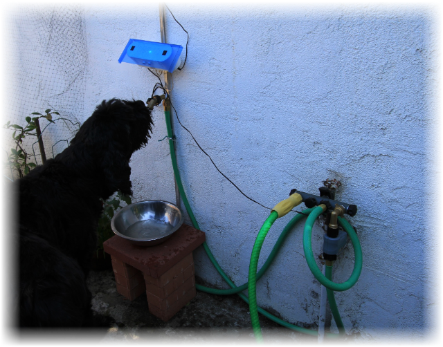

## Introduction

The project started with 2 dogs in a garden and bowls always empty or fill with dirty water. Dogs like fresh water, and two monsters of 100 lbs can consume a lot of water especially under the "hot" California climate.

The first approach was to use an "Outside Faucet Dog Waterer", a mechanical valve put on a faucet and activated by the dog tongue. One dog, the youngest one, try without consistent success and usually finished looking at me for help. The other didn’t even try to look at the valve.

I understand, with some training, both dogs can probably learn how to use a mechanical valve, just I found much more interesting to have a system more intuitive for the dog.

This experience shows:

- It’s not natural for a dog to go near a place where there is no water and push a "button" to get some.
- The youngest dog is always ready to try something new, but the oldest one has apparently some strict manners, and for him a dog should drink from a bowl, not from a faucet.
- When a dog sees water, or hears a water flow, and he is thirsty, he will come to see, and that is without training ;-)

At this point, the only solution was a robot to serve water to the dogs on demand ;-).

Some ideas:

- Start the water when dog approaches to get his attention.
- Avoid to stop the water when dogs are drinking (dog have a moderate sense of humor),
- Stop the water when the dog walks away (bill payer have a moderate sense of humor).
- Have a bowl placed under the faucet to respect “papa” dog habit,
- Try to not overfill the bowl, ideally balance the water output with the dog input.
- Try to have a simple design, simple to build.

## The result

It is now (as July 2014) for almost one year the fountain is online, the dogs use it every day.
I get 2 freezes of the fountain during the year, a simple power off/on solved the problem.

## Build Overview

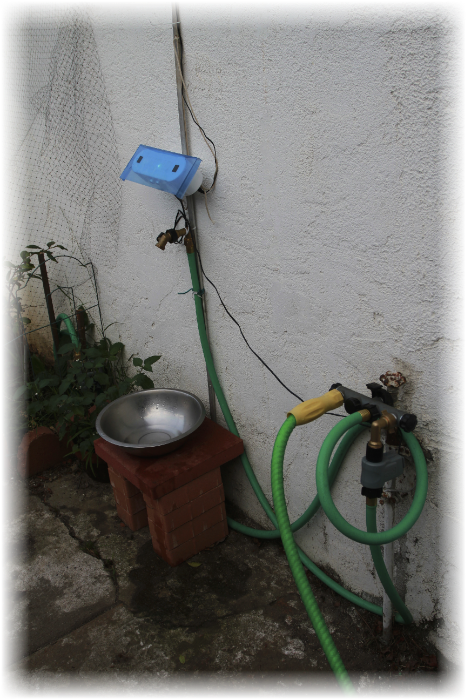

The fountain is mainly composed of two parts:

* the brain, including CPU, sensors and relay
* the valve and faucet.

The existing wall faucet was too low for the dogs, and too cluttered by hoses. A garden hose is used to deport the fountain.

The fountain faucet is placed on the top of a bowl.

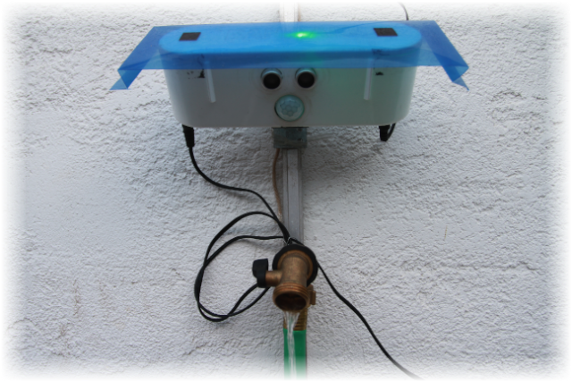

## Components

Components of the Garden's fountain for dogs 

## Water Valve

### Valve location choices

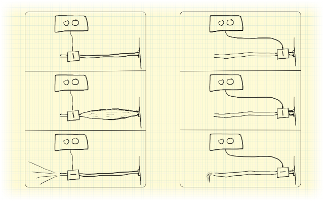

Initially the valve was positioned at the extremity of the hose, but when the valve was closed, the water pressure was expanding the hose… and when the valve open, the elasticity of the hose added to the water pressure was generating a small jet of water...  
and dogs didn’t approve that.

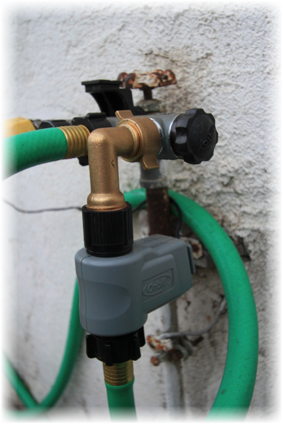

Moving the valve next to the wall faucet solved this inconvenience and we became friend again.

### Analyze of the valve

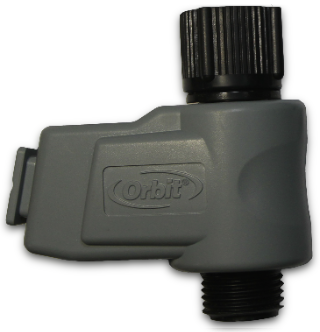
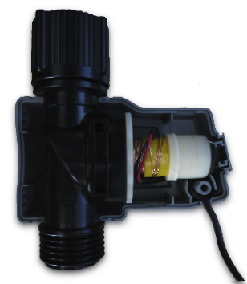

I used one valve I had in stock, not too expensive and easy to find in store.

This valve is designed for battery powered controller, and gets two stable states.  
A DC current pulse is used to change the state between open and close.   
The polarity of the pulse defines the movement direction: open or close.

By testing this solenoid at various DC voltages, it appears that it could actuate down to 11V DC with a current of about 1.4A.
	
### Current and voltage at the valve when the valve open or close

Note:

* Yellow shows the voltage at the valve  
* Blue shows the current at the valve.

#### Valve open

  

Notice the pick of back-emf at the end.

If we zoom at the beginning of the pulse:

we can see some fluctuation at the beginning, but nothing really bad.

On the other side, at the end of the pulse, we clearly see a back-emf effect when the current stop

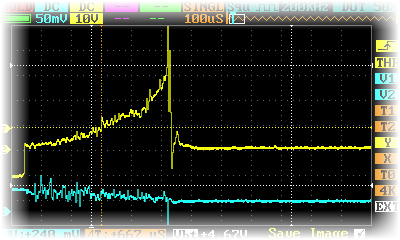

#### Valve Close
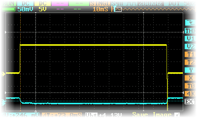

### Timing

To estimate the pulse length needed to actuate, I recorded the valve sound and compared for different pulse length the variation of the sound envelop.

#### Valve Open
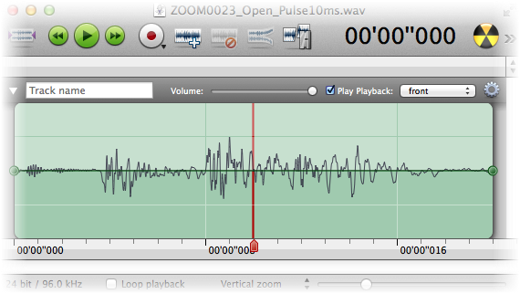   
10ms pulse

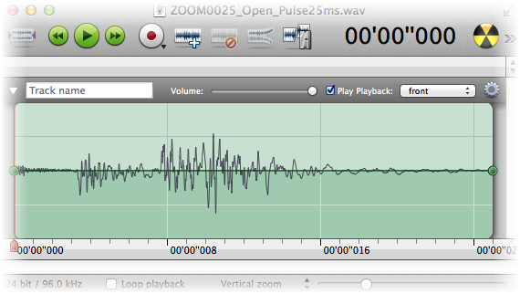   
25ms pulse

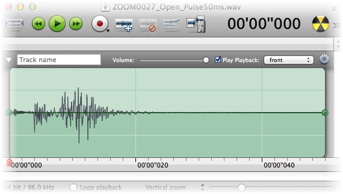   
50ms pulse

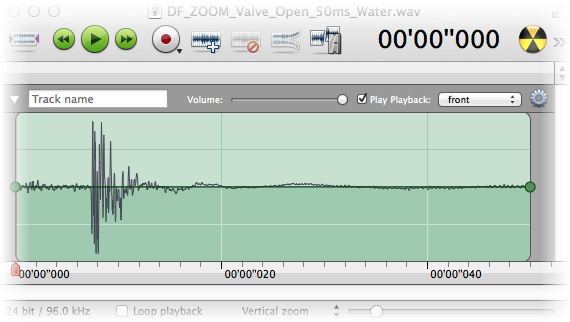  
50ms pulse with water flow, without the relay noise. 

Analysis:
* 10ms pulse compared to the 25ms pulse shows missing power in the second part of the sound wave. 10ms is too short.
* On the other side 25ms compared to 50ms does not show any improvement.
* Presence of water flow does not seem to impact duration.

#### Valve Close
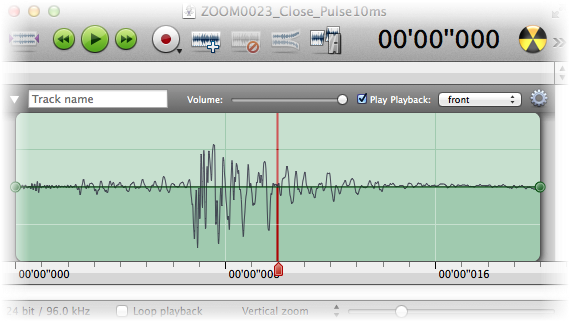  
10ms pulse

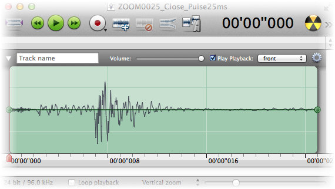  
25ms pulse

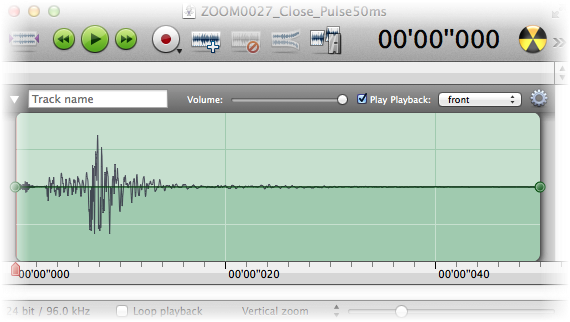  
50ms pulse

The close pulse does not show any difference starting at the 10ms pulse.

#### Detail of a 50ms pulse

Following captures show a 50ms pulse during the open and close.  
First, only the relay sound is recorded. In the order: relay 1 open, close, relay 2 open, and close.  
We can verify the time between the relay: open and close is timed to 50ms.

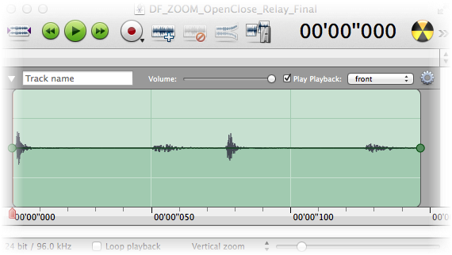

Then, the relay and valve are recorded, with the same sequences.  
We can see much stronger noise created by the valve just after the relay actuates.  
We can also verify the margin between the pulse duration and the valve movement duration.

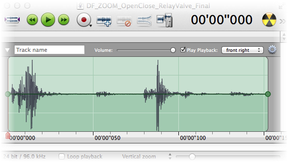

#### Conclusion

A 20ms pulse should open the valve, and a 10ms pulse should close it.   
Closing the valve is an important step to avoid leak. Better to have a lot of margin here.   
To make it simple, we can set the pulse to 50ms in both directions.   
Open and closing of the valve does not happen often, valve is outside, solenoid temperature should not be a problem.

## Valve Connector

The Orbits valve gets a very small power cable, I needed a little more.  
The valve connects to a male connector not available in store, but creating one is pretty simple.

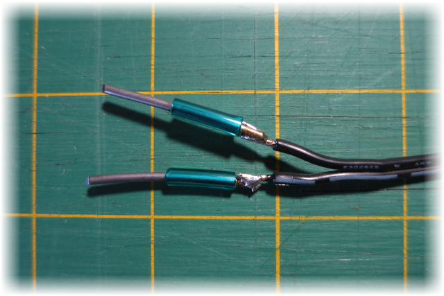

We use 1/16 (1.6mm) solid wire solder to a 2 wires extension cable.

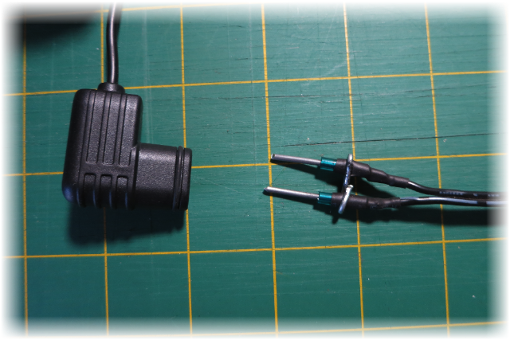


We add Heat-shrink tubing around the soldering, and use a smaller solid wire to keep the distance between the 2 solid wire pins.


The smaller solid wire is turned around 2 pins providing a rigid assembly.

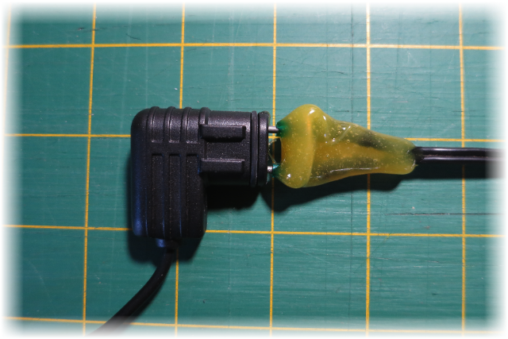

The pin space between the cable are filled with hot melt glue, using the transversal solid wire for support.


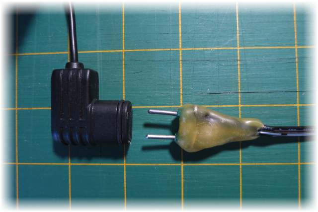

When cold, we cut the two pins to the correct lengths, and smoothing the extremities.
The white cable (positive) connects to the open pin of the Orbit connector.

Waterproofing needs to be added.

## Valve Relay

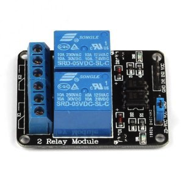
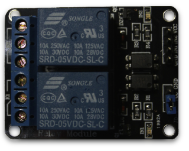

The relays are used to commute the valve. It is a simple solution to commute 12V 1.5A.  
Each relay gets a contact normally-open and normally-close. Pulling to low IN1 or IN2 switch the relay.   
Two relays are needed to generate 3 states: Open Pulse, Close Pulse, and Stay.

### Valve Connection to Relay
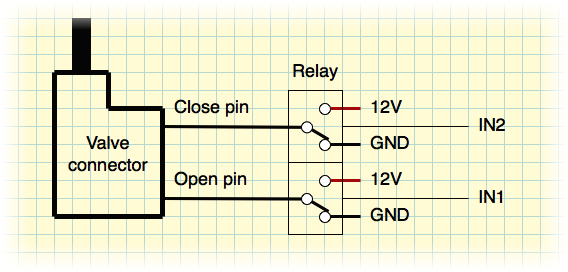

The following table describes the action or the relay input on the valve:

 IN1	| IN2   | Open Pin | Close Pin | State | Description
--------|-------|----------|-----------|-------|----
 Low	| Low	| 12V		| 12V		| Stay | Keep valve state (not used)
 Low	|	High|	12V		| GND		| Open Pulse | Valve switch to Open
 High	|	Low	| GND		|	12V		| Close Pulse | Valve switch to close 
 High	| High	| GND		|	GND		| Stay  | Keep valve state

Reference:
* [wikipedia](http://en.wikipedia.org/wiki/Relay/)

## Fountain Sensor: Proximity

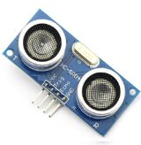
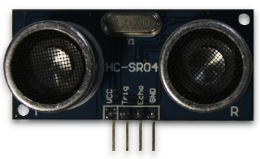

The HC-SR04 Ultrasonic sensor is inexpensive and popular. It can determine the distance of an  object from 2cm (1”) to 3m (10ft) or more.  
The detection area is very narrow, about 2 degrees.

This sensor emits an ultrasonic sound (ping) and the time for the echo to come back gives the distance, like an active sonar.

This sensor gets few drawbacks:
* It is an active sensor, not sure how long before it will fail with continues operation.
* False positive if a fly is moving on the front of the sensor.
* Dog seems to hear the ultrasonic sound, and they might ignore if present continuously.

And some good sides:
* Dogs hear the ultrasonic sound, they can associate the sound with "Hey! Remember! Water is here!”.
* The sensor returns a distance, perfect to fine control of the valve activation.

Reference:
* [wikipedia](http://en.wikipedia.org/wiki/Sonar#Active_sonar)

## Fountain Sensor: PIR

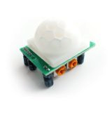
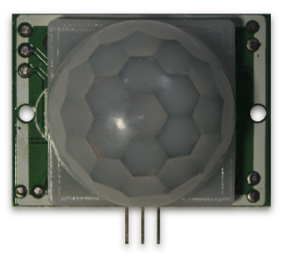

PIR is also inexpensive and popular. It can sense motion of human or animal (heat source) up to 6m (20 ft).  
The detection area is wide, almost 180 degrees.

This sensor gets few drawback:
* It detects only movement of heat source, when the movement stops (dog drinking) the detection also stops.
* The PIR is sensitive to a lot of unwanted type of heat movement, like a flow of hot air, or the cloud that creates moving sun ray on the ground. Outside a PIR can generate a lot of false positive detection.
* Also the PIR gives a very basic information (movement detected) but lack details like the direction of the movement or if the dog is currently drinking, that will make difficult to optimize the water usage.

And some good sides:
* Passive, silence, and probably long life. Does not disturb the environment.
* Large detection area, can see the dog coming from far.

References:
* [wikipedia](http://en.wikipedia.org/wiki/Passive_infrared_sensor)
* [ladyada](http://www.ladyada.net/learn/sensors/pir.html)

## Sensors usage

The idea is to use a tandem of two sensors to detect dog presence and trigger the water flow.

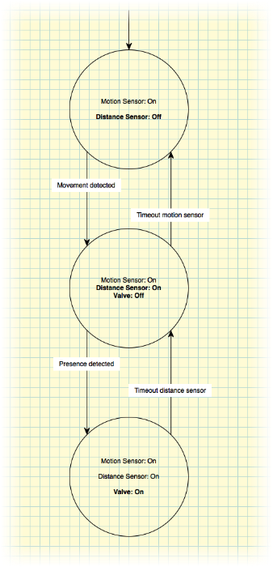

Using a combination of both sensor can improve the detection:
- Initially the ultrasonic sensor is turned off.
- The PIR sensor “scans” the region around the fountain.
- When a dog approaches, the PIR detects the movement and the Ultrasonic sensor starts.
- When the dog reaches the fountain, the Ultrasonic sensor triggers the water fountain
- When the dog leaves, the Ultrasonic sensor triggers the fountain stop
- After a while, if no more movement, the PIR stops the Ultrasonic sensor.  

## Feedback: RGB LED

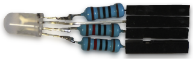

The LED is very useful to debug the fountain code.  
At night the box is glowing with a pulsing white light when the fountain sleeps... very nice effect.

The RGB led provides the following feedback (in order):

Light	| Description
--------|----------
Green | Near presence detected (ultrasonic)
Yellow (Red+Green) | Far presence detected (ultrasonic debug)
Red	| Motion detected (PIR)
Blue | PIR was recently triggered, but no more
White pulsing | Fountain is sleeping
Black | Do you have power?

Note: 
* The table order indicates what will be the feedback if multiple sensors are trigged at the same time, for example if we have both the PIR and ultrasonic, then we will get only the Ultrasonic indication.
* The white pulsing appears if nothing else is present.

The Arduino Nano can provide up to 40mA for each pin. 

We do not need the usual 20mA per LED, 9mA should be enough for our usage.
From the measure of the forward voltage for each color, we get the value for each resistor

Color | FV | ohm
------|---:|----:
Red   |1.7V|180
Green |2.4V|100
Blue  |2.5V|100

## CPU

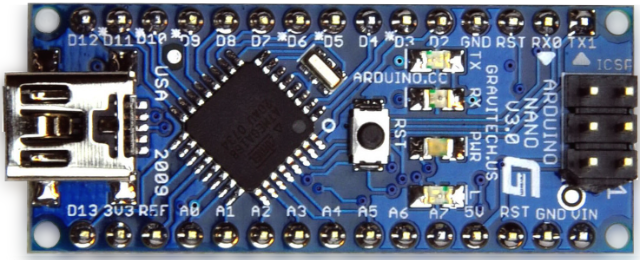

The fountain is based on an Arduino nano, small and inexpensive.

References: 
* [Arduino](http://arduino.cc)

## Fountain Body

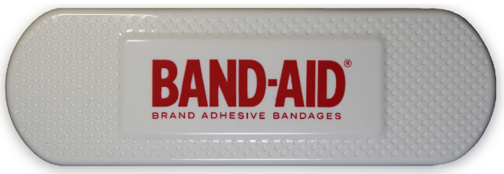

The COSTCO Band-aid box fits very nicely for the purpose.  
The good size, and the compartments inside fit the Arduino and relay almost perfectly. 

## Power Supply

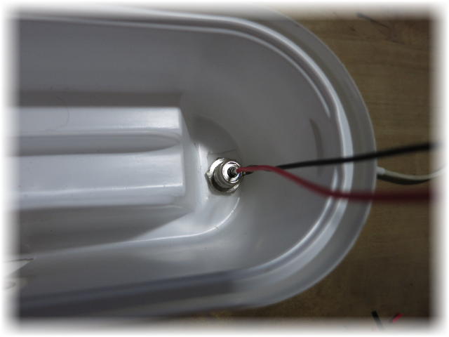

A standard power supply is used, and a connector is added to the bottom of the box.

Note: The same connector is used to connect to the valve.

## Schematic

The schema is pretty simple, few soldering are needed.  

A capacitor (470µF) was added to the power line energizing the valve.  
The capacitor provides a reserve of energy for the valve, and removes all visible back-emf to the power line.  
Without the capacitor, the Arduino is completely unstable.

Note: the capacitor cannot be place directly on the valve because of the valve inversion of polarity.  

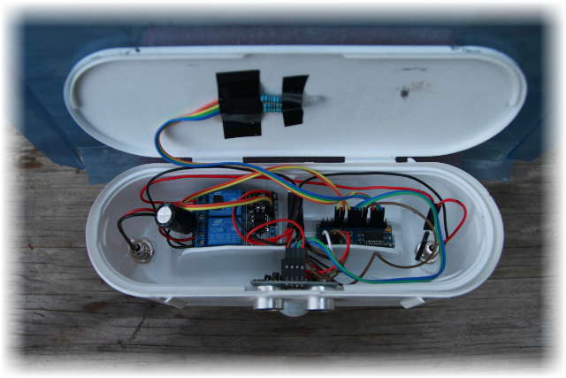

Most connections use Female to Female jumper cable.

The “hat” is a cut from a plastic envelope, fixed on the top of a Band-Aid box.  
That was nice looking hat... but after a year the plastic didn't survive the sun :(

## Parts and Cost

Description | Reference | Quantity | Price | Store
------------|-----------|---------:|------:|:-----:
CPU | Arduino Nano v3.0 | 1 | $13.99 | [Amazon](http://www.amazon.com/SainSmart-Nano-v3-0-for-Arduino/dp/B00761NDHI/ref=sr_1_2?ie=UTF8&qid=1382742241&sr=8-2&keywords=arduino+nano)
Valve| Orbit extra valve | 1 | $13.56 | [Amazon](http://www.amazon.com/Orbit-58874N-Extra-Complete-Watering/dp/B003LY4I2I/ref=pd_sim_lg_2)
Sensor | 2-Channel Relay Module | 1 | $7.18 | [Amazon](http://www.amazon.com/SainSmart-2-CH-2-Channel-Relay-Module/dp/B0057OC6D8/ref=sr_1_1?ie=UTF8&qid=1382743142&sr=8-1&keywords=sainsmart+relay+module+2)
Power Supply | DC 12V 1.5A | 1 | $7.00 |
Connector| 2.1mmx5.5mm DC Power Jack Socket Female | 2 | $5.32 | [Amazon](http://www.amazon.com/gp/product/B00JR591DG/ref=ox_sc_act_title_1?ie=UTF8&psc=1&smid=A1THAZDOWP300U)
Sensor | HC-SR04 Ultrasonic Distance Sensor | 1 | $3.13 | [Amazon](http://www.amazon.com/SainSmart-HC-SR04-Ranging-Detector-Distance/dp/B004U8TOE6/ref=sr_1_1?ie=UTF8&qid=1382741804&sr=8-1&keywords=sr04)
Sensor | HC-SR501 Human Sensor Module Pyroelectric Infrared | 1 | $2.67 | [Amazon](http://www.amazon.com/HC-SR501-Sensor-Module-Pyroelectric-Infrared/dp/B007XQRKD4/ref=pd_bxgy_e_text_y)
Component| Resistors: 1x 180 ohm, 2x 100 ohm| 3 | $0.10 |
Component| RGB Led ($2.67/50)| 1 | $0.05 | [Amazon](http://www.amazon.com/gp/product/B005VMDROS)
Component| Capacitor | 1 | $0.03 | [Amazon](http://www.amazon.com/Joe-Knows-Electronics-Value-Capacitor/dp/B007SVHFXO/ref=sr_1_4?ie=UTF8&qid=1382742843&sr=8-4&keywords=capacitor)
Cable | 20cm Female to Female 2.54mm 0.1 Inch Jumper Cable Wires Connector ($3.99/5)| 1 | $0.80 | [Amazon](http://www.amazon.com/gp/product/B00D8WOWMY)
Box| COSTCO’s Band-Aid (Recycling) | 1 | $0.00 | COSTCO
***Total*** | | | ***$53.83*** |

<!--| DC Power connector 2.1mm x 5.5mm Female | 2 | $7.00 | [Radioshack](http://www.radioshack.com/product/index.jsp?productId=2102486)-->

## Prototype & Test

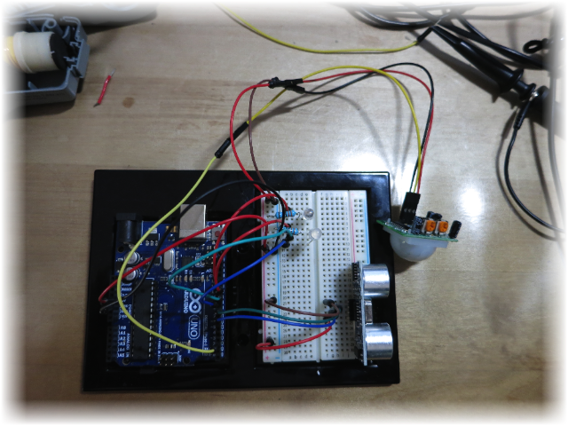

Testing the PIR and Ultrasonic distance sensor.

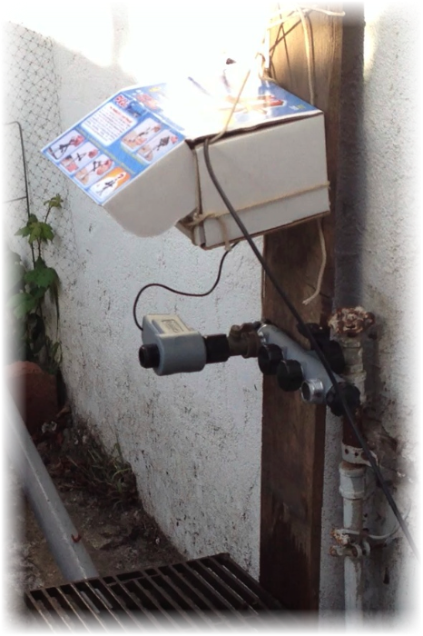

First prototype and it's beautiful box  :)  
Notice the relay directly connected to the wall faucet.

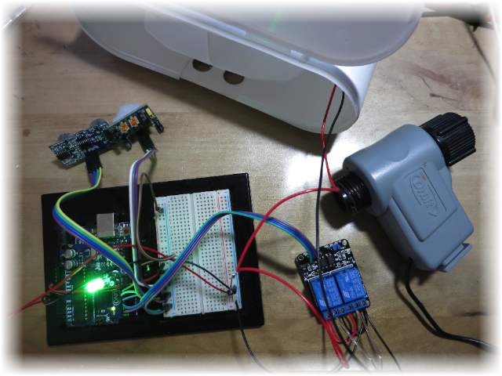

Test of all components before integration.

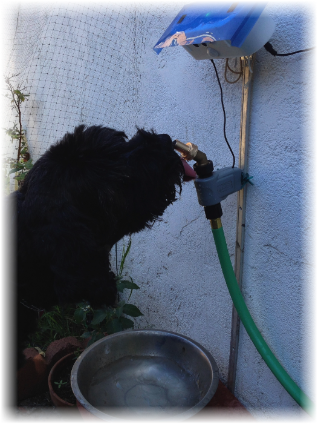

Testing a configuration of the fountain faucet. The valve and the "jet" effect.

#### Testing of the valve

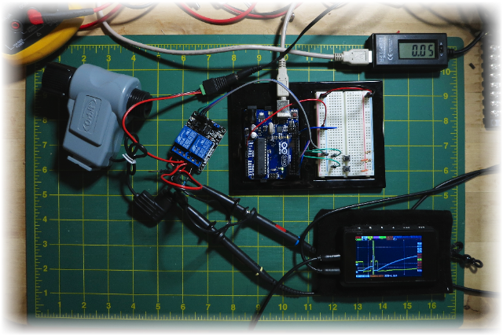

A simple setup to test the valve. The valve is controlled by 2 switches.

